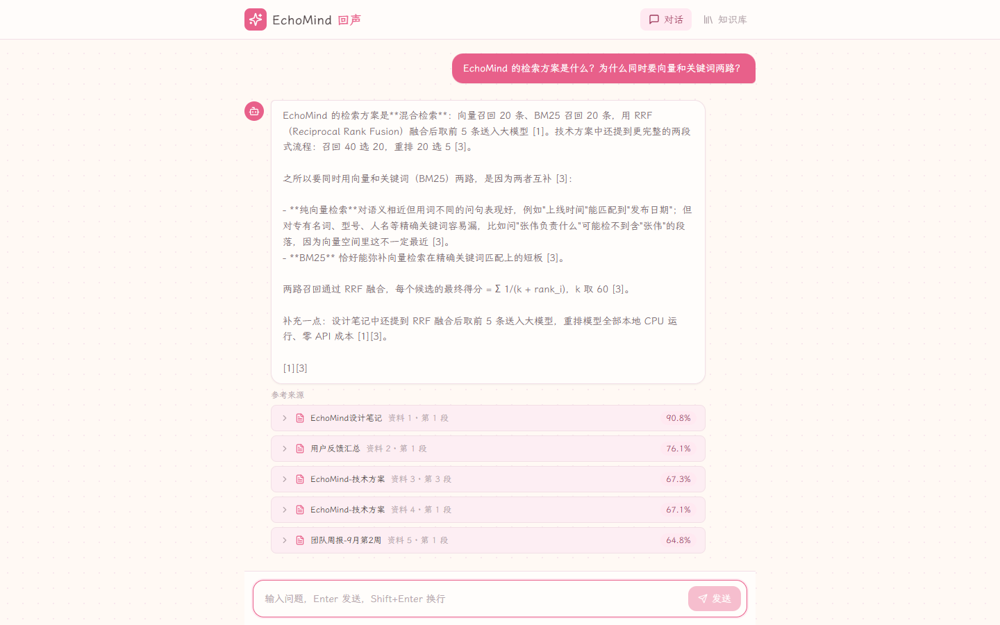

# EchoMind（回声）

> 让每一次发言都有回声。

基于 RAG 的文档知识库问答系统：上传会议记录、设计文档，即可随时提问，得到**带出处引用**的流式回答。与作者的另一个项目 [音阅 yinyue-meeting](https://github.com/Napleee/yinyue-meeting)（会议录音转写）共用一套「樱花」视觉语言，是「会议转写 → 知识沉淀 → 随时追问」产品线的下游一环：音阅产出的会议转写 JSON，正是 EchoMind 最典型的语料。



---

## 项目简介

RAG（Retrieval-Augmented Generation，检索增强生成）分两步：**先**把文档切块并向量化存入 pgvector，**再**在提问时检索出最相关的片段，拼进 Prompt 让大模型"看着证据回答"，从根源上抑制幻觉。

EchoMind 在此基础上做了三层递进：

1. **混合检索**：向量语义召回 + BM25 关键词召回 → RRF 融合。语义相近（"上线日期" ↔ "什么时候发布"）和精确匹配（型号、日期、人名）两条路都不漏；
2. **交叉重排**：bge-reranker 对融合后 Top10 做精排，把"最相关"排到最前（MRR 0.841 → 0.986，见下方实验）；
3. **缓存与限流**：Redis 两层缓存（检索结果 + 完整回答）+ 按 IP 固定窗口限流，热点问题命中缓存约 **25 倍**提速，Redis 故障时自动降级直通不伤可用性。

```
  上传文档 ──▶ 入库管线（异步）                      提问 question
              parse ─▶ chunk ─▶ embed                     │
                 │                        ▼               ▼
                 │            ┌────────────────────────────────┐
                 │            │  PostgreSQL 16 + pgvector      │
                 │            │  chunks 表（HNSW 向量索引）      │
                 │            └────────────────────────────────┘
                 │          向量检索 Top20      BM25(jieba) Top20
                 │                   └─────┬─────┘
                 │                         ▼
                 │                  RRF 融合（k=60）
                 │                         ▼
                 │            bge-reranker 精排 Top10 ─▶ Top5
                 │                         ▼
                 │        ┌─ Redis 回答缓存命中？ ─▶ SSE 回放（cached）
                 │        └─ 否 ─▶ LLM（DeepSeek / 无Key时 mock 回显）
                 │                         │
                 └─────────▶ SSE 流式回答 + chunk 级来源溯源 ◀── 前端(Nginx :8080 / Vite :5173)
```

## 功能特性

- 文档上传：PDF / Word / Markdown / TXT / 会议 JSON，后台上传（202 异步），状态轮询与失败原因可见
- 中文友好切块：500 字符 + 50 字符相邻重叠，边界不断语义（切块大小有实验依据，见下）
- 本地向量化：bge-small-zh-v1.5（512 维，CPU 可跑，零 API 成本）
- 混合检索：向量（pgvector HNSW）+ BM25（jieba 分词）双路召回，RRF 融合
- 交叉重排：bge-reranker-base 精排融合后 Top10（为什么只排 10 个，见「面试考点」）
- 流式问答：SSE 逐 token 输出，回答附 chunk 级引用（文档名 + 原文片段 + 相似度得分）
- 多轮会话：会话与消息落库，刷新页面不丢上下文
- 两层缓存：检索结果缓存 + 完整回答缓存，命中时流式回放并标注「来自缓存」；命名空间版本号失效法，文档增删后立即生效
- 接口限流：Redis 固定窗口按 IP 每分钟 10 次，超限返回 429 + Retry-After
- Mock 模式：不配置任何 API Key 即可全链路演示（LLM 层回显检索结果）
- 评估与实验：36 题测试集，四策略对比（recall@k / MRR）、chunk 大小扫描、压测脚本
- 一键部署：`docker compose --profile full up -d --build` 拉起全栈（前端 Nginx + 后端 + pgvector + Redis）

## 实验数据

所有实验在笔记本 CPU（单 worker）上运行，绝对值供参考，**相对结论**是重点。

### 检索策略对比（36 题 / 7 篇文档 / 105 块）

| 策略 | recall@5 | MRR | 平均检索延迟 |
| --- | --- | --- | --- |
| vector（纯向量） | 88.89% | 0.768 | 49ms |
| bm25（纯关键词） | 97.22% | 0.912 | 25ms |
| hybrid（RRF 融合） | **100%** | 0.841 | 74ms |
| hybrid + rerank（线上链路） | 100% | **0.986** | 8478ms |

复现：`python -m eval.run_eval --strategy {vector,bm25,hybrid,hybrid_rerank}`

- 向量单独用会漏精确词（版本号、日期、人名），BM25 单独用会漏同义改写；RRF 融合后 recall 拉满
- rerank 把 MRR 从 0.841 提到 0.986（几乎每题第 1 名就是答案块），但 CPU 精排延迟 ~8.5s —— 这正是「只精排融合后 Top10 + 缓存兜底」策略的由来

### chunk 大小扫描（同一语料，5 种切块粒度）

| chunk_size | 块数 | 平均块长 | recall@5 | MRR | 入库耗时 | 单次检索 |
| --- | --- | --- | --- | --- | --- | --- |
| 200 | 287 | 152 | 97.2% | 0.843 | 6651ms | 1.3ms |
| 300 | 192 | 228 | 97.2% | 0.780 | 5764ms | 0.8ms |
| **500（默认）** | **105** | **417** | **100%** | **0.848** | 7146ms | 0.7ms |
| 800 | 63 | 696 | 100% | 0.829 | 5287ms | 0.6ms |
| 1200 | 43 | 1019 | 100% | 0.917 | 12302ms | 1.0ms |

复现：`python -m eval.run_chunk_experiment --sizes 200,300,500,800,1200`

- 200/300 的小块把关键信息切断在边界外，recall 掉到 97.2%
- 500 起 recall 稳定 100%；1200 的 MRR 最高但入库成本近翻倍，且大块稀释 Prompt 上下文
- **默认 500 不是拍脑袋**：recall、索引成本、上下文精度三者的平衡点

### 压测（asyncio + httpx，见 `backend/eval/load_test.py`）

| 场景 | 并发 | QPS | P50 | P95 | P99 |
| --- | --- | --- | --- | --- | --- |
| GET /api/documents | 10 | 149.0 | 60ms | 108ms | 154ms |
| GET /api/documents | 50 | 132.8 | 328ms | 564ms | 659ms |
| POST /api/chat 缓存命中 | 5 | 66.8 | 71ms | 101ms | 111ms |
| POST /api/chat 缓存命中 | 20 | 56.0 | 313ms | 560ms | 567ms |

- 单 worker 在并发 10 附近即近饱和（并发 50 时延迟涨 5 倍、QPS 反降），水平扩展方案是多 worker / 多副本
- 缓存命中的 chat（含 SSE 流式回放）P50 313ms，同一问题未命中走完整链路（检索 + 精排 + LLM）约 **7.8s**，提速约 25 倍

## 技术选型

| 层 | 技术 | 选型理由 |
| --- | --- | --- |
| Web 框架 | FastAPI + uvicorn | 原生 async，天然适配 SSE 流式；自动生成 /docs 接口文档 |
| 数据库 | PostgreSQL 16 + pgvector | 关系数据与向量一库搞定，不引入独立向量库（Milvus/Qdrant），运维成本最低；支持 HNSW 索引 |
| ORM | SQLAlchemy 2.0 | Python 生态事实标准，类型标注友好 |
| Embedding | BAAI/bge-small-zh-v1.5 | 中文检索效果好，512 维小模型本地 CPU 可跑，零成本零外发 |
| 关键词检索 | jieba + rank-bm25 | 纯 Python BM25，配合中文分词补齐精确词匹配短板 |
| 融合 | RRF（k=60） | 只依赖排名不依赖分数分布，无需调权，鲁棒性强 |
| 重排 | BAAI/bge-reranker-base | CrossEncoder 交叉编码比双塔向量更准的精排；只排 Top10 控制 CPU 延迟 |
| LLM | DeepSeek（OpenAI 兼容协议） | 便宜且协议通用，改 `LLM_BASE_URL` 即可切智谱 GLM 等厂商 |
| 缓存/限流 | Redis 7 | 两层缓存（检索 + 回答）与固定窗口限流；fail-open 降级 |
| 前端 | React 18 + TS + Vite + Tailwind | SSE 打字机流式渲染、引用卡片；与「音阅」同源的樱花主题 |
| 部署 | Docker Compose + Nginx | 一条命令全栈拉起；Nginx 反代 /api 免 CORS、SSE 关缓冲 |
| 测试 | pytest | 纯逻辑单测（切块、RRF）不触数据库、不下载模型，9/9 通过 |

## 快速开始

前置要求：Docker、Python 3.12、Node.js 18+。

### 方式一：全栈一键部署（推荐体验完整功能）

```bash
# 配置后端环境变量（LLM_API_KEY 可留空，走 mock 模式）
copy .env.example backend\.env        # macOS/Linux: cp .env.example backend/.env

docker compose --profile full up -d --build
```

访问 **http://localhost:8080** —— 前端（Nginx）、后端、pgvector、Redis 全部就绪，
模型缓存与上传文档挂在命名卷里，重建容器不重复下载。

### 方式二：开发模式（热更新调试）

```bash
# 1) 只启动数据库与缓存
docker compose up -d

# 2) 创建虚拟环境并安装后端依赖
python -m venv .venv
.venv\Scripts\activate        # Windows（macOS/Linux: source .venv/bin/activate）
pip install -r backend/requirements.txt -i https://pypi.tuna.tsinghua.edu.cn/simple

# 3) 配置环境变量
copy .env.example backend\.env        # macOS/Linux: cp .env.example backend/.env

# 4) 启动后端（在 backend/ 目录）
cd backend
uvicorn app.main:app --reload --port 8000

# 5) 启动前端（另开终端，在 frontend/ 目录）
npm install
npm run dev
```

浏览器访问 **http://localhost:5173**，上传 `samples/` 目录下的示例文档即可开始提问。
后端健康检查：http://localhost:8000/api/health （首次启动会自动下载 embedding 模型，走国内镜像）。

### 评估与压测（在 backend/ 目录）

```bash
python -m eval.run_eval --strategy hybrid_rerank   # 四种策略任选，recall@5 + MRR
python -m eval.run_chunk_experiment --sizes 200,300,500,800,1200   # chunk 大小扫描
python -m eval.load_test --scenario documents  --concurrency 10 --total 300
python -m eval.load_test --scenario chat-cached --concurrency 20 --total 100
```

## 配置说明

所有配置通过 `.env`（放在 backend/ 目录）注入，见 `.env.example`（全中文注释）。常用项：

| 变量 | 默认值 | 说明 |
| --- | --- | --- |
| `LLM_API_KEY` | 空 | **留空 = mock 模式**，不调 LLM 直接回显检索结果 |
| `LLM_BASE_URL` / `LLM_MODEL` | DeepSeek | OpenAI 兼容协议，改两项即换厂商（示例：智谱 glm-4-flash） |
| `CHUNK_SIZE` / `CHUNK_OVERLAP` | `500` / `50` | 切块大小与重叠（字符），取值有实验依据 |
| `VECTOR_TOP_K` / `BM25_TOP_K` / `FINAL_TOP_K` | `20` / `20` / `5` | 两路召回条数与最终送入 Prompt 条数 |
| `ENABLE_RERANK` | `false` | 重排开关（`.env.example` 含说明，容器部署默认开） |
| `RERANK_CANDIDATES` | `10` | 进入精排的候选条数，越多越准也越慢 |
| `CACHE_TTL_SECONDS` | `1800` | 两层缓存 TTL（秒） |
| `RATE_LIMIT_PER_MIN` | `10` | 提问接口按 IP 每分钟限次（≤0 关闭） |
| `HF_ENDPOINT` | `https://hf-mirror.com` | HuggingFace 国内镜像 |
| `DATABASE_URL` / `REDIS_URL` | localhost | 容器内自动切换为服务名 `db` / `redis`（compose 已处理） |

## 项目结构

```
项目3/
├── docker-compose.yml          # db + redis（开发模式）/ + backend + frontend（--profile full 全栈）
├── .env.example                # 环境变量模板（全中文注释）
├── samples/                    # 示例语料（设计笔记 / 周报 / 反馈 / 会议转写 JSON）
├── docs/                       # 截图与实验记录
├── backend/
│   ├── Dockerfile              # python:3.12-slim + CPU 版 torch（避免 CUDA 巨包）
│   ├── requirements.txt
│   ├── app/
│   │   ├── main.py             # FastAPI 入口 + /api/health + 模型预热线程
│   │   ├── core/               # config.py（配置）/ db.py（引擎与会话）
│   │   ├── models/             # Document / Chunk / Conversation / Message
│   │   ├── schemas/            # Pydantic 请求/响应契约
│   │   ├── api/                # 路由：documents / chat（SSE + 缓存 + 限流）
│   │   └── services/           # parsers / chunker / embedder / retriever / reranker / llm / cache / ingestion
│   ├── eval/                   # questions.yaml(36题) / run_eval(四策略) / run_chunk_experiment / load_test
│   └── tests/                  # 纯逻辑单测（test_chunker / test_rrf，9/9 通过）
└── frontend/
    ├── Dockerfile              # 多阶段构建：Node 构建 → Nginx 托管
    ├── nginx.conf              # SPA 回退 + /api 反代（SSE 关缓冲）
    └── src/                    # React 18 + TS：聊天流式渲染 / 文档管理 / 会话侧栏
```

## 面试考点

- **混合检索与 RRF 公式**：向量检索擅长语义泛化（"上线日期" ↔ "什么时候发布"），BM25 擅长精确词（"10 月 15"、"bge-small-zh-v1.5"），两路召回互补——本项目 36 题实测：vector 单独 88.89%，bm25 单独 97.22%，RRF 融合 100%。RRF 按`score(d) = Σ 1/(k + rank_i(d))`融合，**只看名次不看分数**，避免了两路分数量纲不可比、需要调权重的问题。
- **为什么 rerank 只排 Top10**：CrossEncoder 对每个 (query, chunk) 对做完整前向，延迟随候选数线性涨。精排的职责是「把对的块从候选里挑出来排到最前」，融合后前 10 名已覆盖全部正确块（recall@10 = 100%），对 40 个候选全量精排只增加 CPU 延迟、不改善最终 Top5。实测只排 Top10 时 MRR 0.986。
- **HNSW 与 IVF 对比**：HNSW 是多层跳表式近邻图，查询近似 O(logN)、召回高，代价是内存大、构建慢；IVF 先聚类再只搜最近的 nprobe 个簇，内存省、构建快，但召回受 nprobe 影响需要调参。本项目数据量在百万级以下，选 HNSW（`vector_cosine_ops`）一步到位；数据到亿级再考虑 IVF 或分层方案。
- **两层缓存的设计**：检索结果缓存（省 embedding + 检索 + 重排）与完整回答缓存（连 LLM 调用都省，命中直接 SSE 回放并标记 `cached`）。失效用**命名空间版本号**（key 前缀带版本号，文档增删时 `INCR` 一键废弃全部旧缓存），比逐 key DEL 简单且无遗漏。Redis 不可用时 fail-open 降级直通——缓存挂了不能把主链路拖挂。
- **固定窗口限流的缺陷**：窗口边界处可承受 2 倍突发（59s 和 61s 各打满 10 次）。已知权衡：要更平滑可上滑动窗口 / 令牌桶（Redis + Lua 原子操作），当前规模下固定窗口的实现成本与可解释性更优——面试时能讲清缺陷比「用了高级算法」更加分。
- **chunk 策略**：块太大→语义稀释、Prompt 变长变贵；块太小→上下文断裂。本项目做了 5 档扫描实验（见上表），500 是 recall/成本/精度的平衡点——**用数据回答「为什么是 500」**。
- **mock 模式的设计动机**：演示环境网络不可控（Key 失效、厂商限流），mock 让检索→融合→引用溯源的主链路完全不依赖外部服务即可验证；同时倒逼 LLM 层接口先定型（`stream_answer(question, context_blocks)`），换真模型只是换实现，不动架构。

## 与「音阅」的姐妹关系

[音阅 yinyue-meeting](https://github.com/Napleee/yinyue-meeting) 把会议录音变成结构化转写，EchoMind 把转写沉淀为可追问的知识库——前者是「说」，后者是「回声」。两者共享同一套樱花视觉语言（奶油底色、樱粉主色、霞鹜文楷、圆点纸纹），放在一起是一站式「会议 → 知识」工作台的雏形。

## Roadmap

- [x] 阶段1：基础设施 + 数据模型 + 文档入库管线
- [x] 阶段2：混合检索（向量 + BM25 + RRF）+ SSE 流式问答 + 前端
- [x] 阶段3：重排（bge-reranker，`ENABLE_RERANK` 灰度开关）
- [x] 阶段4：评估体系（recall@k + MRR，四策略对比 + chunk 大小扫描实验）
- [x] 阶段5：Redis 两层缓存 + 限流 + 压测 + Docker 全栈部署
- [ ] 展望：nDCG / LLM-as-judge 端到端答案评估、多用户与权限、对话式改写 query

## License

MIT
